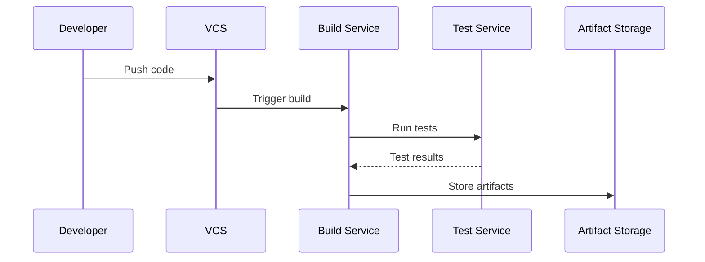
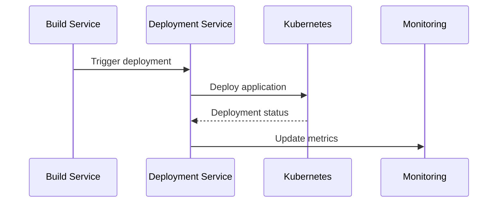

# Architecture Documentation

## System Overview

The Advanced CI/CD Pipeline system is designed with a microservices architecture, enabling scalable, maintainable, and reliable continuous integration and deployment processes. The system is deployed across multiple cloud providers for high availability and disaster recovery.

## Architecture Components

### 1. Frontend Dashboard

The frontend dashboard is a React-based single-page application that provides real-time visualization of:
- Build and deployment status
- Test results and coverage
- System metrics and alerts
- Deployment history
- Performance analytics

**Key Technologies:**
- React 18
- TypeScript
- Material-UI
- Chart.js
- WebSocket for real-time updates

### 2. Backend Services

The backend is composed of several microservices:

#### API Gateway
- Handles authentication and authorization
- Routes requests to appropriate services
- Implements rate limiting and request validation
- Provides API documentation

#### Build Service
- Manages build pipelines
- Handles code compilation
- Generates artifacts
- Integrates with version control systems

#### Test Service
- Executes unit tests
- Runs integration tests
- Performs end-to-end testing
- Generates test reports

#### Deployment Service
- Manages deployment strategies
- Handles rollback procedures
- Coordinates multi-cloud deployments
- Implements zero-downtime deployments

#### Monitoring Service
- Collects system metrics
- Manages alerts
- Generates performance reports
- Integrates with monitoring tools

### 3. Infrastructure

#### Cloud Providers
- AWS (Primary)
- Azure (Secondary)
- Google Cloud (Tertiary)

#### Kubernetes Clusters
Each cloud provider hosts a Kubernetes cluster with:
- Node pools for different workloads
- Auto-scaling groups
- Load balancers
- Ingress controllers

#### Service Mesh
Istio service mesh provides:
- Traffic management
- Security
- Observability
- Load balancing

### 4. Data Storage

#### Primary Database
- PostgreSQL for application data
- Redis for caching
- MongoDB for metrics and logs

#### Object Storage
- S3-compatible storage for artifacts
- Container registry for Docker images
- Backup storage

### 5. Monitoring & Observability

#### Metrics Collection
- Prometheus for metrics collection
- Grafana for visualization
- Custom dashboards
- Alert rules

#### Logging
- ELK Stack for log aggregation
- Log retention policies
- Log analysis tools

#### Tracing
- Jaeger for distributed tracing
- OpenTelemetry integration
- Performance profiling

## System Interactions

### 1. Build Process

### 2. Deployment Process

## Security Architecture

### 1. Authentication & Authorization
- JWT-based authentication
- Role-based access control
- OAuth2 integration
- API key management

### 2. Network Security
- VPC isolation
- Network policies
- TLS encryption
- WAF integration

### 3. Secrets Management
- HashiCorp Vault
- Kubernetes secrets
- Environment variables
- Secure key rotation

## High Availability

### 1. Multi-Region Deployment
- Active-active configuration
- Cross-region replication
- Global load balancing
- Disaster recovery

### 2. Auto-scaling
- Horizontal pod autoscaling
- Cluster autoscaling
- Resource optimization
- Cost management

### 3. Backup & Recovery
- Automated backups
- Point-in-time recovery
- Disaster recovery plans
- Business continuity

## Performance Optimization

### 1. Caching Strategy
- Redis caching
- CDN integration
- Browser caching
- API response caching

### 2. Load Balancing
- Layer 7 load balancing
- Session affinity
- Health checks
- Circuit breaking

### 3. Resource Management
- Resource quotas
- Pod limits
- Node affinity
- Pod anti-affinity

## Deployment Strategies

### 1. Rolling Updates
- Zero-downtime deployments
- Health checks
- Rollback capability
- Gradual rollout

### 2. Canary Releases
- Traffic splitting
- A/B testing
- Feature flags
- Gradual rollout

### 3. Blue-Green Deployment
- Parallel environments
- Traffic switching
- Rollback capability
- Environment isolation

## Monitoring & Alerting

### 1. Metrics Collection
- System metrics
- Application metrics
- Business metrics
- Custom metrics

### 2. Alert Rules
- Threshold-based alerts
- Anomaly detection
- Predictive alerts
- Alert correlation

### 3. Dashboard
- Real-time monitoring
- Historical analysis
- Custom visualizations
- Export capabilities

## Development Workflow

### 1. Local Development
- Docker Compose setup
- Local Kubernetes
- Development tools
- Debugging support

### 2. CI/CD Pipeline
- Automated testing
- Code quality checks
- Security scanning
- Deployment automation

### 3. Code Review Process
- Pull request workflow
- Code review guidelines
- Automated checks
- Documentation requirements

## Future Considerations

### 1. Scalability
- Horizontal scaling
- Vertical scaling
- Database scaling
- Cache scaling

### 2. Integration
- Third-party services
- Custom integrations
- API extensions
- Webhook support

### 3. Features
- AI/ML integration
- Advanced analytics
- Custom dashboards
- Extended monitoring

## Architecture Decisions

### 1. Technology Choices
- Microservices architecture
- Kubernetes orchestration
- Multi-cloud deployment
- Service mesh implementation

### 2. Design Patterns
- Event-driven architecture
- CQRS pattern
- Circuit breaker pattern
- Bulkhead pattern

### 3. Trade-offs
- Complexity vs. scalability
- Cost vs. performance
- Security vs. usability
- Flexibility vs. standardization 